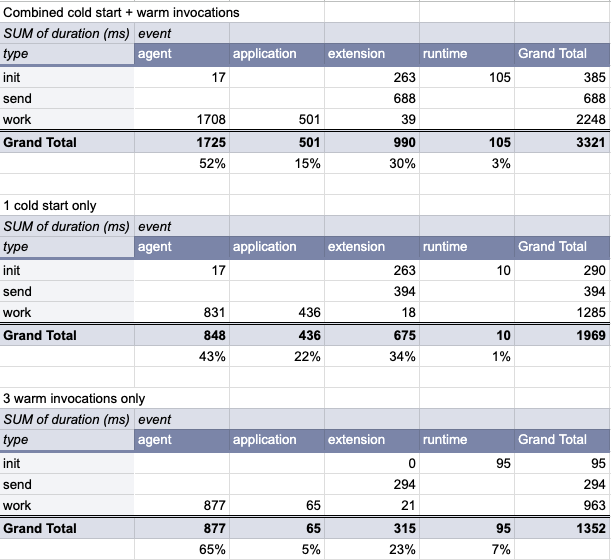

# dt-headers benchmark function

While this function doesn't do much besides write some logs to CloudWatch, I've used it as a benchmark to track performance of the function with a [New Relic Lambda layer](https://layers.newrelic-external.com/).

## Setup

1. I performed one cold start + three warm invocations.
2. I then exported the CloudWatch logs to a CSV file and imported them to [a Google sheet](https://docs.google.com/spreadsheets/d/12vORLZUUoyO2JrmPSHP5gxT2OMAsD9JVuuJYo_Cdn_4/edit?usp=sharing).
3. Finally, I organized the data and created a pivot table that summarizes duration by type of log entry.

## Results

While your function's performance will vary from mine, this same approach can be used to get a sense of where time is being spent during a cold start and subsequent warm invocations after adding a New Relic layer.

- For an application that doesn't do much, like mine, 40-60% of the time in a cold start comes from the [New Relic Node.js Agent](https://github.com/newrelic/node-newrelic) which needs to wrap the function's dependencies and instrument spans.
- The [New Relic Lambda Extension](https://github.com/newrelic/newrelic-lambda-extension) typically takes up 20-35% of the time in my function, mostly for sending payloads, and optionally logs, to New Relic. This shipping time is typically faster than the time it would take to send the same payloads and logs via the CloudWatch path using our [newrelic-log-ingestion function](https://github.com/newrelic/aws-log-ingestion).

